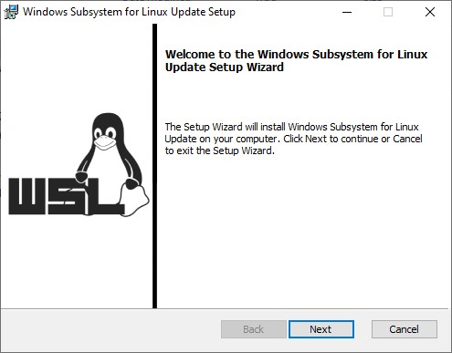
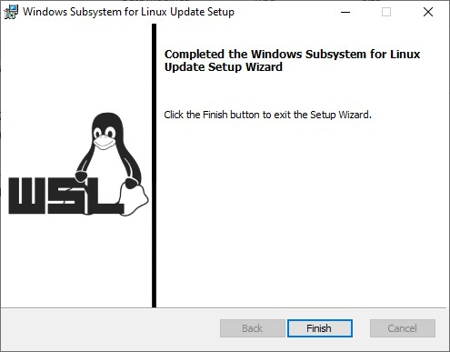
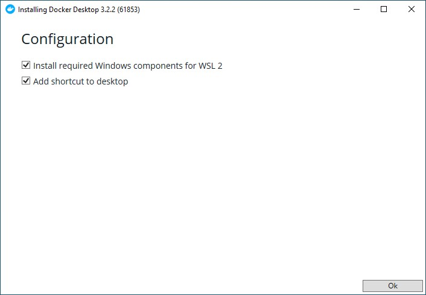
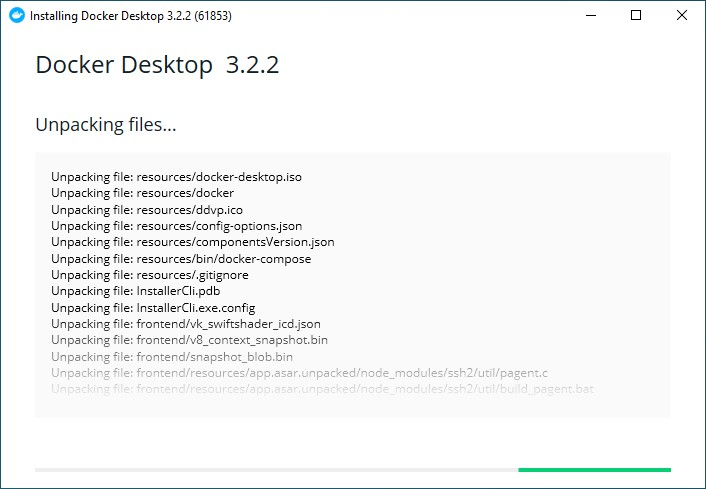
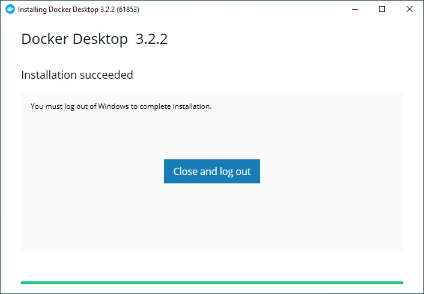
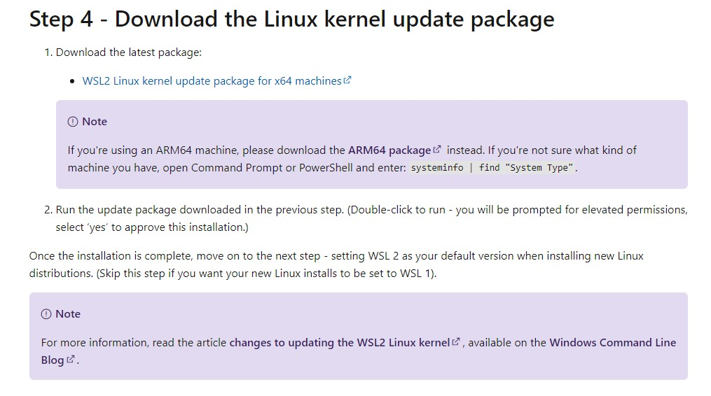
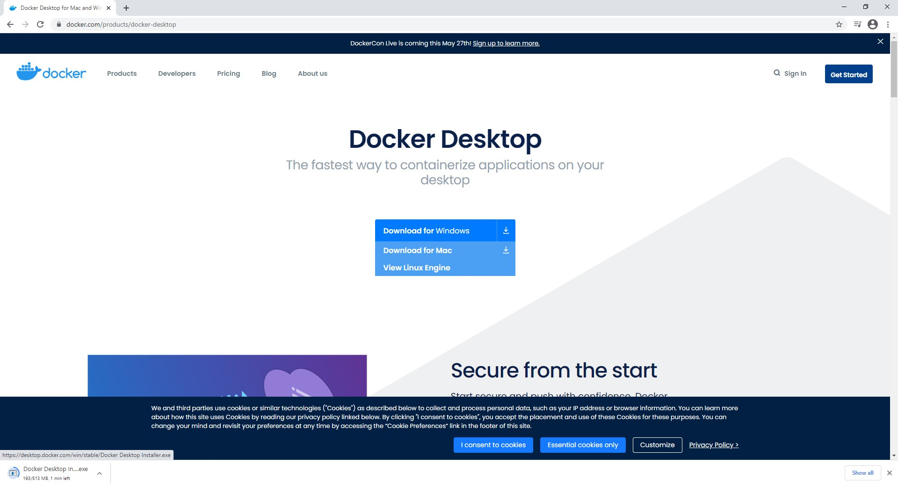

This is document provides instructions on how to install docker and WSL (which is used by Docker). 

Note this guide is for _**Windows devices only**_. If you have a device with other operating systems we recommend you to find another guide (don't worry, there are plenty out there). 

# Step 1 -  WSL Installation
The installation of WSL can be tricky under normal circumstances... but fear not! We've made it simple for you. Just follow these few steps and you're set. 

1. Run the script called `install_1.bat` (you can find it in the same folder as this document)
2. Reboot your computer
3. Press [this](https://wslstorestorage.blob.core.windows.net/wslblob/wsl_update_x64.msi) link and it will automatically download a file called `wsl_update_x64.msi` - if it doesn't do this, then follow the instructions in _Extra Steps_ and download the file manually
4. Run `wsl_update_x64.msi` and press next until finished

5. Run `install_2.bat`
(you can find it in the same folder as this document)

That's it, you're done. Now it's only one final step left - _installing docker_. 

# Step 2 - Docker Installation
1. Press [this](https://desktop.docker.com/win/stable/Docker%20Desktop%20Installer.exe) link and it will automatically download a file called `Docker Desktop Installer.exe` - if it doesn't do this, then follow the instructions in _Extra Steps_ and download the file manually
2. Run `Docker Dekstop Installer.exe` 
3. Press OK in the configuration panel

4. Press _Close and log out_ when you see Installation succeeded

### *And that's all, now you're done! Go back to the main folder and run the __docker.bat__*
Altough make sure that you or somebody else has filled in all the required environment (`.env.local`) variables in both `/server` and `/app` (read about this in the main folders Readme document)

 # Extra steps

### Manual download of `wsl_update_x64.msi`
  1. Go to [this website](https://docs.microsoft.com/en-us/windows/wsl/install-win10) and then scroll down to _Step 4_

   

  2. Press _WSL2 Linux kernel update package for x64 machines_ and the file should be downloaded

### Manual download of `Docker Desktop Installer.exe`

 1. Go to [this website](https://www.docker.com/products/docker-desktop) and select the **_download for windows_**
 
 

 _A big thanks to Jeremy Lo Ying Ping who helped us create this guide_ 